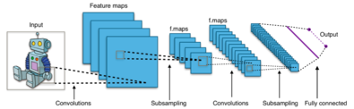
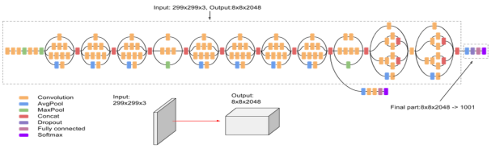
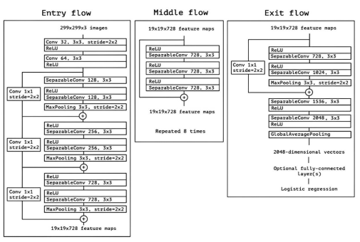
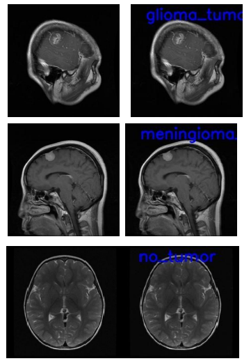

# MRI Scans detect Brain Tumor

*Model based approach to extract information about Brain Tumor from MRI scans*

1. **Convolutional Neural Network** (CNN)   CNNs are specialised neural networks that are used for image recognition and classification tasks. These networks use multiple layers with adjustable filters to process input data through convolution operations, followed by a non-linear activation function. A CNN architecture comprises convolutional, pooling, ReLU (Rectified Linear Unit), and fully connected layers 
 **Convolutional Layer**: This layer extracts features from input data by applying trainable filters (kernels). The filters scan small regions of the input image and produce a feature map.
  The *mathematical representation* of the convolution process is: 
G[m, n] = (f * h)[m, n] = ΣjΣk h[j, k]f[m − j, n − k] where f is the input image and h is the kernel
 
  **ReLU Layer**: ReLU is a non-linear activation function that replaces negative values in the feature map with zero, defined as f(x) = max(0, x).
 
 **Pooling Layer**: This layer reduces the dimensions of the activation map while preserving essential information. It divides the input image into non-overlapping regions and applies a down-sampling operation, such as max pooling.
 
 **Fully Connected Layer**: This layer functions as a traditional classifier, using the information generated by the previous layers to provide a final classification output. The CNN output must be flattened before being fed into the fully connected layer.

 

2. **Inception V3**   The Inception V3 model is a deep learning framework for image classification that builds upon the original Inception V1 (GoogLeNet) model. Inception V3 comprises 42 layers and has a reduced error rate compared to earlier versions. The main enhancements in this model include breaking down convolutions into smaller components, spatial factorisation through asymmetric convolutions, the role of auxiliary classifiers, and optimised grid size reduction 
**Factorized Convolutions**: This technique reduces the computational load by decreasing the number of parameters in the network.

 **Asymmetric Convolutions**: A 3x3 convolution can be substituted with a 1x3 convolution followed by a 3x1 convolution.
 
 **Auxiliary Classifier**: An auxiliary classifier is a compact CNN integrated between layers during training, with its loss contributing to the overall network loss. In InceptionV3, these classifiers function primarily as regularisers.
 
  **Grid Size Reduction**: Grid size reduction is commonly achieved through pooling operations.

 

3. **Xception**  The Xception architecture is a CNN that extends the Inception architecture. The central innovation of Xception is the replacement of traditional convolutional layers with depthwise separable convolutions. 
*Xception* refines the Inception approach further by decomposing convolutional layers into depthwise separable convolutions, a two-step operation that improves computational efficiency.
 
 The Xception module has three main parts: the Entry flow, the Middle flow (repeated 8 times), and the Exit flow.
 
  The entry flow has two blocks of convolutional layers followed by a ReLU activation. The architecture includes various separable convolutional layers and max pooling layers. Skip connections are also utilised, merging two tensors using the 'ADD' operation.

4. **Test results** 

## Results comparison

| Contribution | Type of classifier | Accuracy | 
| :--: | :--: | :--: |
| Proposed approach | CNN | 0.96 |
| Proposed approach | Inception | 0.99 |
| Proposed approach | Xception | 0.99 |
| Pashaei et al. [28] | CNN | 0.9368 |
| Gumaei et al. [29] | FNN (feedforward neural network) | 0.9423 | 